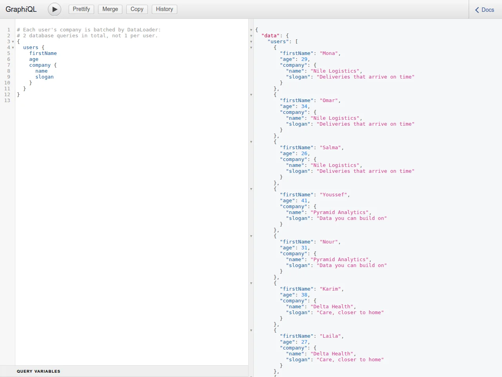

# GraphQL API — Users & Companies

A GraphQL API built with Express, Mongoose and `graphql-js` for managing users and the companies they work for.
It covers the parts of GraphQL that matter beyond CRUD: nested relations resolved without N+1 queries
(DataLoader), reading only the fields a query asks for, and clear errors for missing records.



## Highlights

- **No N+1 queries.** `users { company { … } }` takes two database queries however many users there are:
  DataLoader batches every company lookup into one `find()`, and does the same for `companies { users { … } }`.
  Loaders are created per request, so their cache never serves data a mutation has since changed.
- **Field-level projection.** Resolvers turn the query's selection set into a MongoDB projection, so
  `{ users { firstName } }` reads only `firstName`.
- **Safe mutations.** Updates change only the fields passed and return the updated record; updating or deleting a
  missing id is an error, not a silent success; deleting a company detaches its users.
- **Tests** run real GraphQL operations against MongoDB and count the queries sent (Node's built-in test runner).

## Schema

```graphql
type User    { id: ID, firstName: String, age: Int, company: Company }
type Company { id: ID, name: String, slogan: String, users: [User] }

type Query {
  user(id: ID!): User
  users: [User]
  company(id: ID!): Company
  companies: [Company]
}

type Mutation {
  createUser(firstName: String!, age: Int!, companyId: ID): User
  updateUser(id: ID!, firstName: String, age: Int, companyId: ID): User
  deleteUser(id: ID!): String
  createCompany(name: String!, slogan: String!): Company
  updateCompany(id: ID!, name: String, slogan: String): Company
  deleteCompany(id: ID!): String
}
```

## Running locally

Needs Node.js 20+ and MongoDB (`docker run -d -p 27017:27017 mongo:7` works).

```bash
npm install
cp .env.example .env
npm run seed     # 3 companies, 8 users
npm run dev      # http://localhost:4000/graphql (GraphiQL in the browser)
```

Try it:

```graphql
{ companies { name users { firstName age } } }

mutation { createUser(firstName: "Ali", age: 28) { id firstName } }
```

## Tests

```bash
MONGODB_URI=mongodb://127.0.0.1:27017/graphql_test npm test
```

Use a throwaway database: the tests wipe it. They check query batching (by counting the queries Mongoose
sends), projection, update and delete behaviour, and that a request never sees a stale cache.

## Project structure

```
server.js            Express app, /graphql endpoint, per-request loaders
database/            MongoDB connection and Mongoose models
schema/schema.js     Queries and mutations
schema/types.js      User and Company types
schema/projection.js Selection set → MongoDB projection
loaders/loaders.js   DataLoaders for user → company and company → users
scripts/seed.js      Demo data
test/                Integration tests
```
